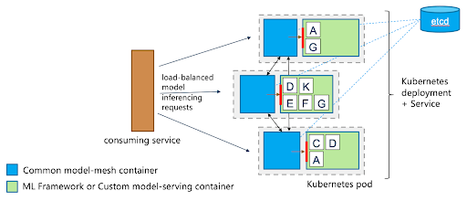

# Model Serving on OpenShift

This document covers usage information for the WML-Serving/Model-Mesh backend
with the KFServing TrainedModel interface on OpenShift. In KFServing's multi-model serving paradigm,
a TrainedModel custom resource represents a machine learning model that is placed inside a designated
InferenceService pod.

With this WML-Serving/Model-Mesh backend, no InferenceServices are needed, and instead the models represented by
each TrainedModel resource are deployed into Model-Mesh. Models served in this setup will be co-located with other models in the
model serving containers.



## Installation

1. Install WML-Serving with Model-Mesh
    - These projects are in the process of being open-sourced, so installation instructions will
      will be provided at a later time.
    - Instructions assume that the namespace used is `wml-serving`.
2. Install the KFServing [TrainedModel CRD](https://github.com/kubeflow/kfserving/blob/master/config/crd/serving.kubeflow.org_trainedmodels.yaml)
    - `oc apply -f https://raw.githubusercontent.com/kubeflow/kfserving/master/config/crd/serving.kubeflow.org_trainedmodels.yaml`

WML-Serving + Model-Mesh will be installed in a single namespace and is namespace isolated. Therefore KFServing TrainedModels
need to be created in the same namespace as WML-Serving.


## Usage

### Deploy

Users deploy models using KFServing's `TrainedModel` custom resource.

```bash
oc apply -f sklearn.yaml -n wml-serving
```

Taking a look at `sklearn.yaml`:

```yaml
apiVersion: serving.kubeflow.org/v1alpha1
kind: TrainedModel
metadata:
  name: example-sklearn-mnist-svm
  annotations:
    wmlserving.ai.ibm.com/secret-key: wml-serving-example-models
spec:
  inferenceService: ''
  model:
    storageUri: s3://wml-serving-example-models-public/sklearn/mnist-svm.joblib
    framework: sklearn
    memory: 256Mi
```

Currently, only S3 based storage is supported. S3 credentials are expected to be stored in a secret called `storage-config`. This means that the `storage-config` secret can contain a map of several keys that correspond to various credentials.

Example credentials format:

```
wml-serving-example-models: |
  {
    "type": "s3",
    "access_key_id": "cab983f11822423ca9e222f898d54a8f",
    "secret_access_key": "abbeff6a32aef6c2374ae69eef503e6dd0c22d6a74bc2467",
    "endpoint_url": "https://s3.us-south.cloud-object-storage.appdomain.cloud",
    "region": "us-south",
    "default_bucket": "wml-serving-example-models-public"
  }
```

In the TrainedModel spec, the annotation `wmlserving.ai.ibm.com/secret-key` is used as a placeholder for this needed `secretKey` field.

The `inferenceService` field can be left as an empty string to let WML-Serving handle the model placement into a suitable serving runtime. However,
a specific `ServingRuntime` can be passed in if desired. The built-in `ServingRuntimes` include `triton-2.x` and `mlserver-0.x`

Some current mappings from framework to ServingRuntimes:

```
tensorflow -> triton-2.x
onnx       -> triton-2.x
tensorrt   -> triton-2.x
pytorch    -> triton-2.x
sklearn    -> mlserver-0.x
xgboost    -> mlserver-0.x
lightgbm   -> mlserver-0.x
```

Currently, the `memory` field is not used with the WML-Serving backend, but it is a required field in the TrainedModel CRD.
Thus, any arbitrary memory amount can be passed in.

### Checking

After deploying, list the TrainedModels to check the status.

```bash
oc get trainedmodels -n wml-serving
```

Depending on if a `ServingRuntime` was already deployed for another model or not, readiness for
the newly deployed model may take a bit (~1 min). Generally, deployment of models into existing
`ServingRuntimes` is quick (few seconds).

```bash
NAME                 URL                                                       READY   AGE
example-sklearn-tm   grpc://wml-serving:8033?mm-vmodel-id=example-sklearn-tm   True    12s
```

### Performing Inference

Currently, only gRPC inference requests are supported. By default, WML-Serving uses a
[headless Service](https://kubernetes.io/docs/concepts/services-networking/service/#headless-services)
since a normal Service has issues load balancing gRPC requests. See more info
[here](https://kubernetes.io/blog/2018/11/07/grpc-load-balancing-on-kubernetes-without-tears/)

If a user has access to the OpenShift cluster, the headless Service can be port-forwarded:

```bash
oc port-forward --address 0.0.0.0 service/wml-serving 8033 -n wml-serving
```

Then a gRPC client generated from the KFServing [grpc_predict_v2.proto](https://github.com/kubeflow/kfserving/blob/master/docs/predict-api/v2/grpc_predict_v2.proto)
file can be used with `localhost:8033`. A Python example is provided [here](../grpc-predict).

Further configuration like using an Envoy proxy may be employed to allow external access while maintaining
distributed gRPC load balancing.

